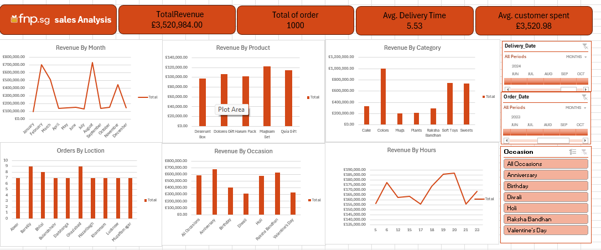

# FNP Sales Analysis Dashboard

📊 *Sales Analysis Dashboard for Ferns and Petals (2023)*  

This project analyzes sales data from *Ferns and Petals (FNP)*, a company specializing in gifts for occasions such as Diwali, Raksha Bandhan, Holi, Valentine's Day, Birthdays, and Anniversaries. The dataset includes details about products, orders, customers, and delivery dates.

The objective was to uncover key insights about *sales trends, customer behavior, and product performance* and present them visually in a dashboard to support business decisions.

---

## Datasets

The project uses three main datasets:

- *sorder.csv*: Contains order details, order dates, delivery dates, and quantities.  
- *customer.csv*: Contains customer information including name, location, and contact details.  
- *products.csv*: Contains product details, prices, and categories.

These datasets were used to analyze sales trends, customer behavior, and product performance throughout 2023.

---

## Dashboard Overview

The *Dashboard for the full year 2023* is presented below as a single image summarizing the key business insights:

> The dashboard demonstrates my ability to analyze data, identify trends, and present insights visually—key skills for a *Data Analyst role*.

---

## Key Analyses Performed

- *Total Revenue*: Overall revenue for 2023.  
- *Average Order & Delivery Time*: Evaluated order processing and delivery efficiency.  
- *Monthly Sales Performance*: Tracked sales trends across months.  
- *Top Products by Revenue*: Identified highest revenue-generating products.  
- *Customer Spending Analysis*: Calculated average spending per customer.  
- *Sales Performance by Top 5 Products*: Compared top-performing products.  
- *Top 10 Cities by Number of Orders*: Determined cities with highest demand.  
- *Order Quantity vs. Delivery Time*: Checked if larger orders affected delivery times.  
- *Revenue Comparison Between Occasions*: Compared revenue across different occasions.  
- *Product Popularity by Occasion*: Identified most popular products per occasion.

> Note: All analyses are summarized in the dashboard image above.

---

## Skills & Tools Used

- Microsoft Excel (Pivot Tables, Charts, Dashboard Design)  
- Data Cleaning & Transformation  
- Business Insights & Storytelling  
- Analytical Thinking & Problem Solving

